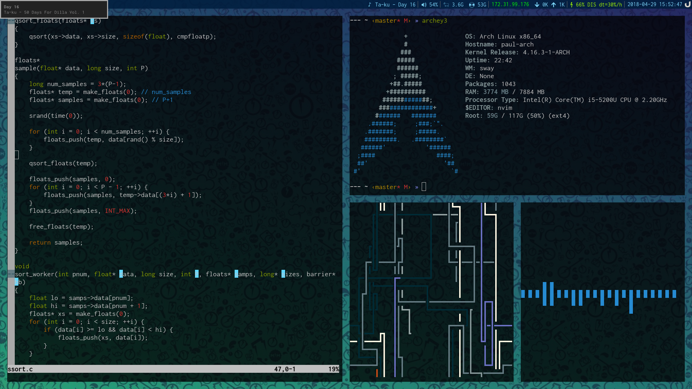

# dotfiles

My Linux configuration files.   

# What I do
I have the following Wayland-based setup:
* Display Mananger: [SDDM](https://github.com/sddm/sddm) - A minimal display manager
* Window Manager: [Sway](http://swaywm.org/) - An i3 drop-in Wayland compositor 
* Terminal: [Sakura](https://launchpad.net/sakura) - A minimal Wayland terminal
* Shell: [Oh My](https://github.com/robbyrussell/oh-my-zsh) [Zsh](http://www.zsh.org/) - Shell with better autocomplete and nice theming
* Application Launcher: [Ulauncher](https://ulauncher.io/) - Like dmenu, but for Wayland

But I break that on a semi-monthly basis (Usually due to Wayland jank-ery and my own incompetence), so I also run an X compositor setup that goes something like this:
* Window Manager: [XMonad](http://xmonad.org/) - Tiling window manager written in Haskell
* Terminal: [URxvt](http://software.schmorp.de/pkg/rxvt-unicode.html) - A minimal X terminal
* Application Launcher: [Dmenu](https://tools.suckless.org/dmenu/) - Like dmenu, but it is dmenu

I also have a very minimally configured [LXQT](https://lxqt.org/) Desktop environment that I hardly ever use.
